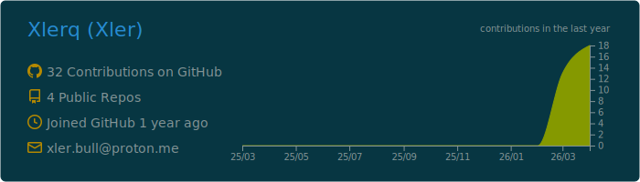
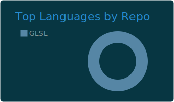
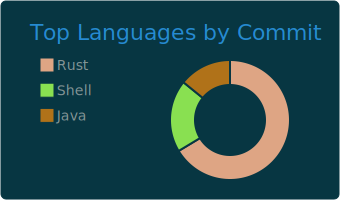
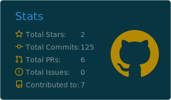
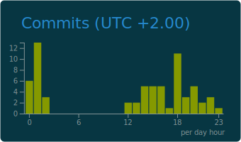

<h1 align="center">Hi, I'm Xlerq</h1>

  Data Science student from Poland
   
  I enjoy coding in Rust, working with data, and endlessly polishing my Arch Linux rice.

  
  
  
  

## About Me

- I am a Data Science student from Poland.
- I like building things in Rust and keeping my workflow terminal-first.
- I spend a very normal amount of time ricing Arch Linux and tweaking my setup.
- I enjoy the overlap between code, data, and clean Linux environments.

## GitHub Stats

  

  
  

  
  

## Current Vibe

- Rust
- Data Science
- Arch Linux
- Hyprland
- Terminal tooling
- Clean UI, clean code, clean rice
